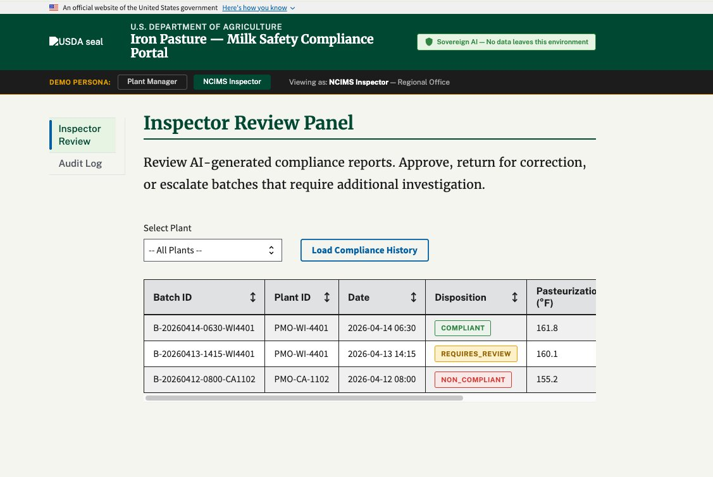
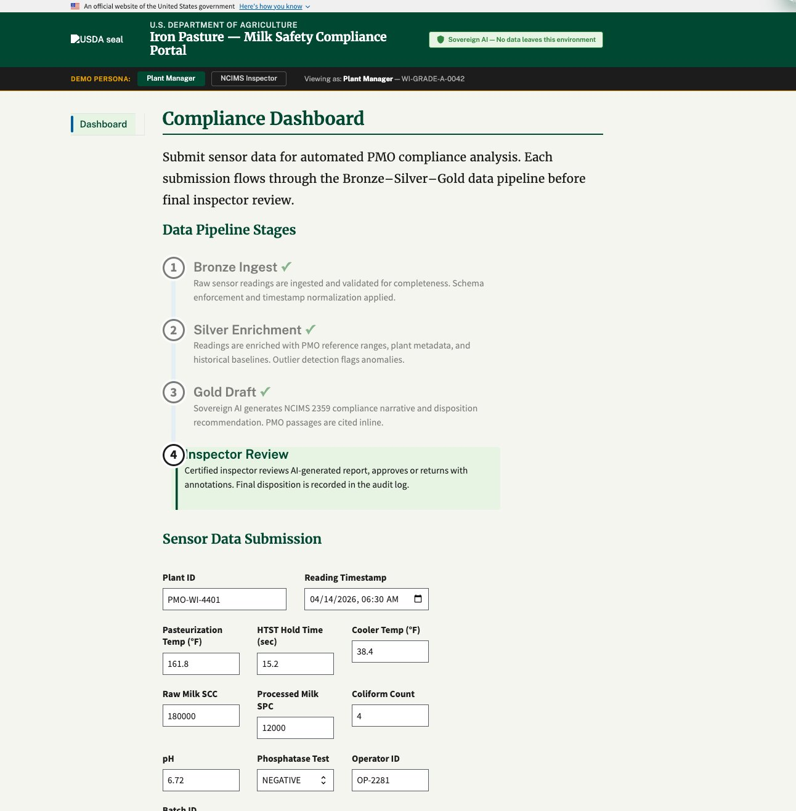
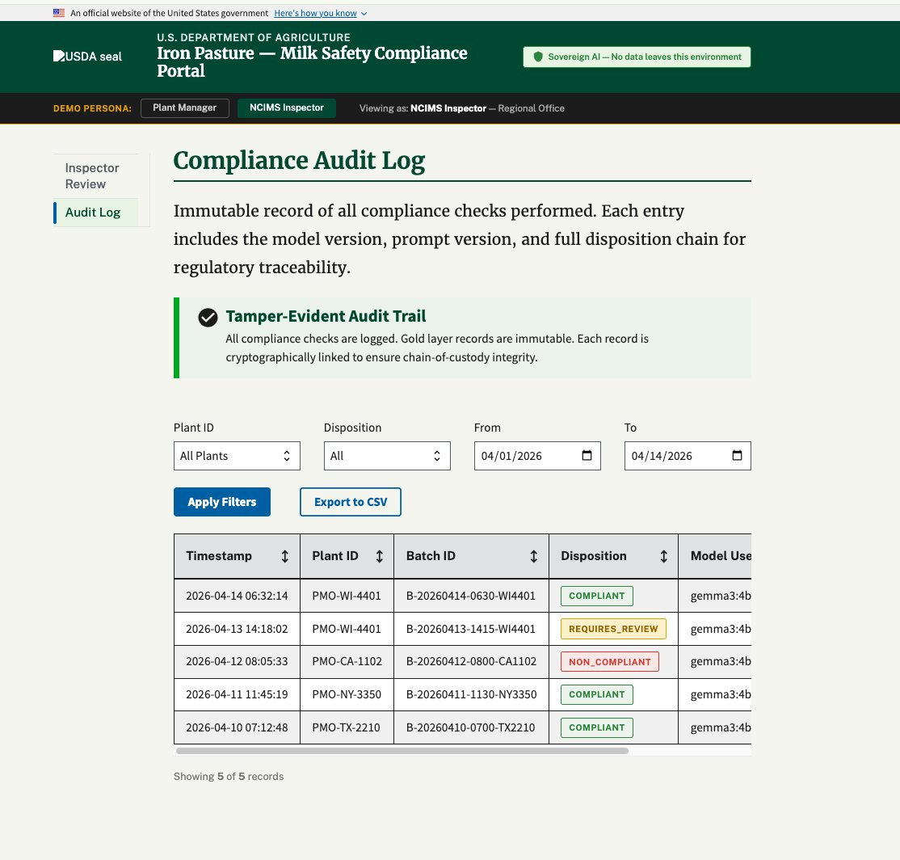
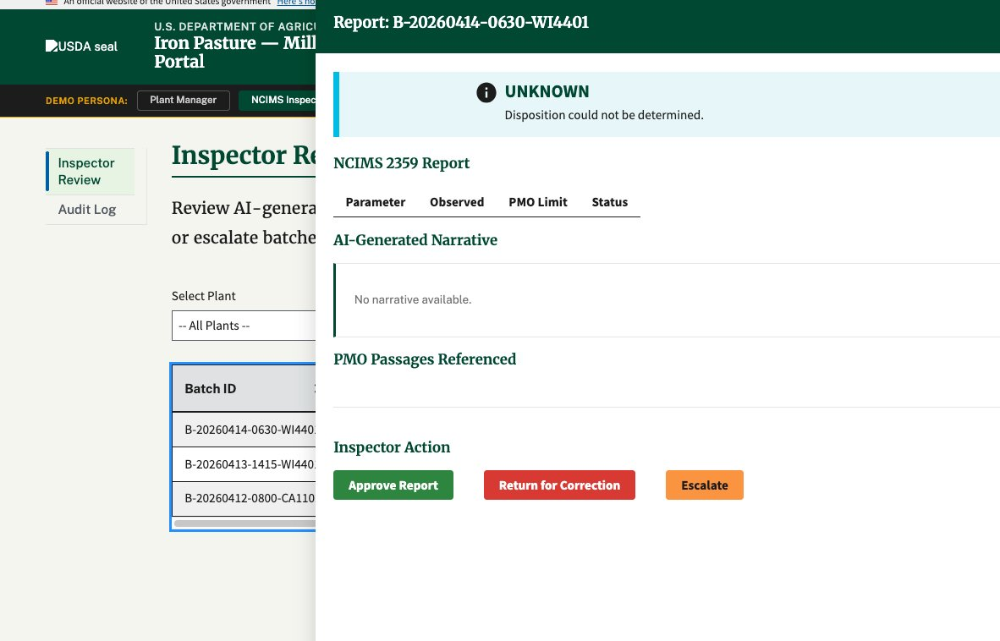

<p align="center">
  
</p>

# Iron Pasture

**U.S. Department of Agriculture — Milk Safety Compliance Portal**

> Sovereign AI — No data leaves this environment

Powered by VCF & Tanzu Platform + Tanzu Data Intelligence

---

## The Problem

Dairy processors operating under USDA Grade A certification generate continuous safety data — pasteurization temperatures, bacterial counts, phosphatase results — that must be manually cross-referenced against the Pasteurized Milk Ordinance and transcribed into federal inspection forms. A single missed threshold or transcription error can trigger a product recall, license suspension, or federal enforcement action.

AI can close this gap — but plant operational data and process parameters cannot leave the facility. Any solution must run entirely on-premises, produce explainable outputs, and generate a defensible audit trail for USDA regulators.

| Hours | < 60 sec | 7 | 0 bytes |
|:---:|:---:|:---:|:---:|
| Typical time to prepare a NCIMS inspection report manually | Time from sensor submission to drafted compliance report | PMO regulatory sections evaluated per batch submission | Plant data transmitted to a public API |

## The Solution

Iron Pasture is a sovereign AI compliance portal that accepts raw plant sensor readings and automatically produces a pre-filled NCIMS 2359 inspection report — grounded in the full text of the Pasteurized Milk Ordinance, with every regulatory citation and compliance decision captured in an immutable audit log.

**Plant operators submit data. The AI does the regulatory reasoning. Human inspectors make the final call.**

```
Bronze Ingest  ──>  Silver Enrichment  ──>  Gold Draft  ──>  Inspector Review
```

| Stage | Description |
|-------|-------------|
| **Bronze Ingest** | Raw sensor readings + PMO document chunks (append-only) |
| **Silver Enrichment** | Normalized readings, PMO threshold flags, top-k passage retrieval |
| **Gold Draft** | NCIMS 2359 draft, full audit trail, model + prompt version |
| **Inspector Review** | Human adjudication — Approve / Return / Escalate |

## VMware & Tanzu Products

- **VMware Cloud Foundation (VCF)** Private AI Foundation
- **Tanzu Platform** (Cloud Foundry)
- **Tanzu Data Intelligence** (Greenplum + pgvector)
- **Tanzu GenAI Tile** (sovereign LLM inference — no external API calls)

---

## Application Screenshots

### Fig. 1 — Plant Manager Dashboard

<p align="center">
  
</p>

The Plant Manager submits batch sensor readings via the USWDS-compliant form. The Bronze-Silver-Gold pipeline stages are shown with live status indicators. All fields map directly to PMO Section 7 and 16p compliance parameters.

### Fig. 2 — Inspector Review Panel (NCIMS Inspector view)

<p align="center">
  
</p>

The NCIMS Inspector sees cross-plant compliance history with color-coded disposition badges (COMPLIANT, REQUIRES_REVIEW, NON_COMPLIANT). Role separation ensures Plant Managers cannot access this view.

### Fig. 3 — NCIMS 2359 Report Detail

<p align="center">
  
</p>

Clicking a batch opens the AI-generated NCIMS 2359 report with parameter-level pass/fail status, the LLM compliance narrative, and PMO passages referenced. The inspector can Approve, Return for Correction, or Escalate.

### Fig. 4 — Compliance Audit Log

<p align="center">
  
</p>

The immutable Gold layer audit log records every compliance check with timestamp, plant ID, disposition, and model version. Date-range and disposition filters support regulatory review. Export to CSV is available for external reporting.

---

*Iron Pasture demonstrates that regulated industries don't have to choose between AI-powered efficiency and data sovereignty. The compliance intelligence stays inside the perimeter. The paperwork takes care of itself.*

---

CONFIDENTIAL — NOT FOR PUBLIC DISTRIBUTION | Iron Pasture | Powered by Tanzu Platform & Tanzu Data Intelligence
